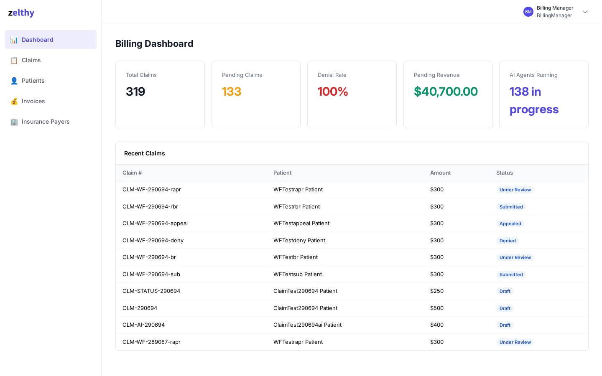
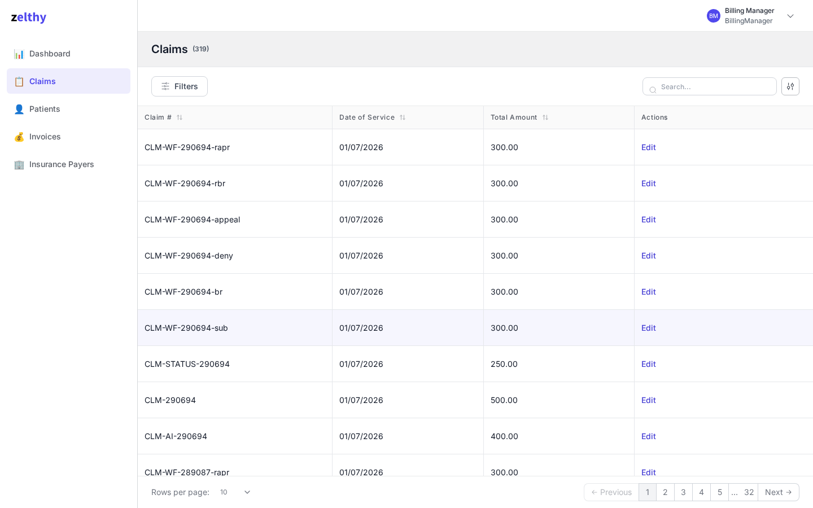
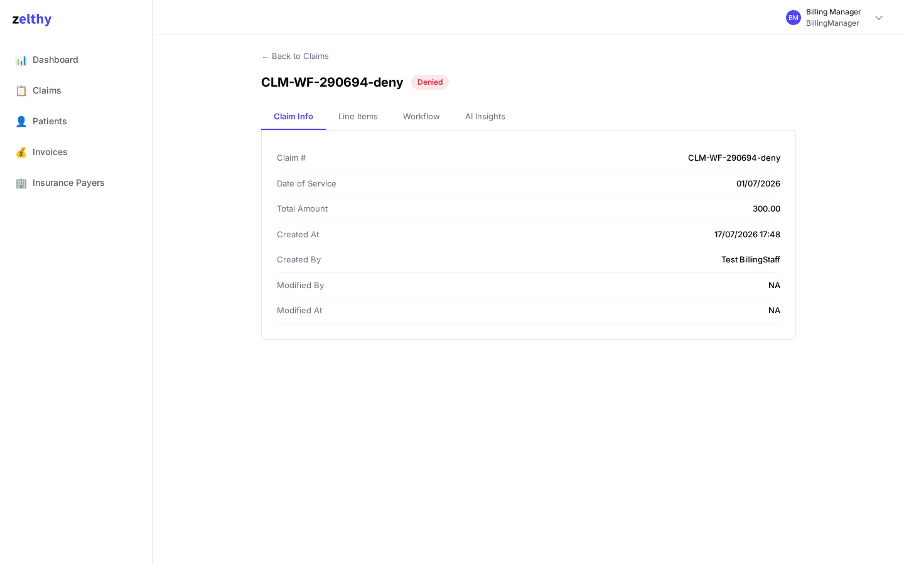
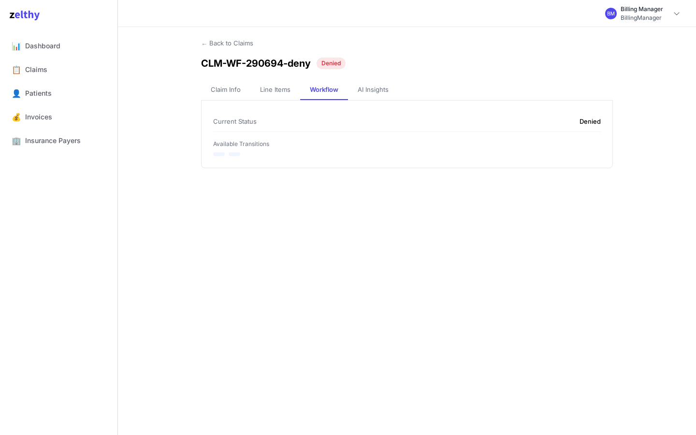

# Patient Billing System

Zango take-home prototype demonstrating a concurrent insurance-claim lifecycle with three independent AI agents.

## Architecture

Claims move through a workflow-driven lifecycle:

```text
Draft -> Submitted -> Under Review -> Approved -> Closed
                         |
                         v
                       Denied -> Appealed -> Closed
```

- Submitting a claim dispatches the `claim-validator` agent.
- Denying a claim dispatches `denial-analyzer` and `appeal-drafter` as two independent Celery tasks.
- The denial agents are deliberately not chained. They run on separate workers and may finish in either order.
- Agent tools read server-bound claim context and atomically write each agent's owned Claim output field.

### Why denial dispatch is concurrent

ADR-001 treats denial analysis and appeal drafting as independent work, so the denial transition sends two separate Celery tasks rather than chaining one agent after the other. That keeps one agent's failure or latency from blocking the other agent's output, and lets separate workers complete both jobs as quickly as possible. The frontend reflects this design by polling the AI Insights tab every five seconds while the outputs are still pending, so the denial analysis and appeal draft can appear in either order.

### Prompt-injection boundary

Under ADR-003/PAT-31, the server binds the claim ID in a `ContextVar`; the model does not supply the ID used by the tools. This matters because the agent reads `claim.notes`, which is user-controlled free text: a malicious note cannot redirect the write to a different Claim.

## Stack

| Layer | Technology |
|---|---|
| Application framework | Zango / Django |
| Frontend | React |
| Background jobs | Celery |
| Database | PostgreSQL |
| Broker | Redis |

## Prerequisites

- Docker and Docker Compose
- An `/etc/hosts` entry for `patientbilling.localhost`:

  ```text
  127.0.0.1 patientbilling.localhost
  ```

## Quick start

From a fresh clone:

```bash
cd patientbilling
cp deploy/.env.example deploy/.env
sg docker -c "docker compose -f deploy/docker_compose.yml up -d"
bash deploy/scripts/bootstrap_demo.sh
```

Compare env variable names without printing values: `bash deploy/scripts/safe_env_diff.sh`.

Open the app at <http://patientbilling.localhost:8000/app>.

The platform admin panel is at <http://localhost:8000/platform>.

## Test credentials

| User | Password | Role |
|---|---|---|
| `staff@billing.local` | `Billing@123` | BillingStaff |
| `manager@billing.local` | `Billing@123` | BillingManager |

Platform admin: `platform_admin@zango.dev` / `Zango@123`.

## AI setup and testing

Normal tests use the deterministic `local_fake` provider and do not need an API key:

```bash
bash deploy/scripts/setup_ai.sh
bash deploy/tests/run_ai_tests.sh
```

The fake provider returns hardcoded, schema-valid outputs while exercising the same agent registration, task, tool, ContextVar, and Claim persistence plumbing. The full suite is safe to run without provider credentials:

### Using a real AI provider

By default this project runs on a zero-key deterministic fake provider (`local_fake`) — no API key needed for the demo to work end-to-end. To use a real LLM instead:

1. Add your key to `deploy/.env`: `ANTHROPIC_KEY=sk-ant-...`
2. Run:

   ```bash
   set -a; source deploy/.env; set +a; bash deploy/scripts/setup_ai.sh
   ```

That's it — the script detects the key, registers a real provider, and repoints all three agents to it. Re-run the same command any time to re-sync after adding or rotating a key.

```bash
sg docker -c "docker compose -f deploy/docker_compose.yml exec -T app bash -c \
  'cd /zango/tests && python -m pytest unit/ integration/ -v --tb=short 2>&1'"
```

Real-provider testing is a separate, final smoke test only. Store the key in the local App Panel configuration; never commit or print it. For Anthropic setup:

```bash
ANTHROPIC_KEY="sk-ant-..." bash deploy/scripts/setup_ai.sh
AI_LIVE_SMOKE=1 AI_PROVIDER_CONFIGURED=1 bash deploy/tests/run_ai_live_smoke.sh
```

Do not run the live smoke command as part of normal development or CI.

## Demo walkthrough

What to notice is the asynchronous result, not just the clicks: the AI Insights tab fills as background work completes, and after denial the denial analysis and appeal draft arrive independently rather than in a fixed order.

1. Sign in as `staff@billing.local`.
2. Create a patient with insurance details.
3. Create a payer and a claim with diagnosis codes and a total amount.
4. Submit the claim and observe the validator output in AI Insights.
5. Sign in as `manager@billing.local`.
6. Deny a claim with a denial reason.
7. Observe denial analysis and the appeal draft populate independently.
8. Appeal the claim and complete the workflow.

### Screenshots

**Billing dashboard** — summary cards (total/pending claims, denial rate, pending revenue) and the AI agent activity count:



**Claims list**:



**Claim detail**:



**Workflow tab** — current status and available transitions for the signed-in role:



The AI Insights tab (validator score, denial analysis, appeal draft) fills in a few seconds after
submit/deny — it polls every 5s until all relevant agent outputs land. That's an async result at a
moment in time, so it's best seen live via the walkthrough above rather than a static screenshot.

### Things to try

- Submit a claim with an incomplete diagnosis/CPT code and watch the validator's completeness score and issue list.
- Deny a claim and refresh the AI Insights tab within a few seconds — the denial analysis and appeal draft fields fill in independently, not in a fixed order, since they run as two separate Celery tasks.
- Log in as `staff@billing.local` vs `manager@billing.local` and compare the menu — the Dashboard is manager-only.
- Try to deny a claim as `staff@billing.local` — the transition is role-gated and should be rejected.

## Known limitations and future work

- AI-generated validation, denial analysis, and appeal drafts are advisory-only, displayed for human review, and never automatically drive workflow transitions.
- There is no dedicated audit trail for prior AI outputs; closing that gap would require storing history rather than only the current Claim fields.
- The development database has no HIPAA-oriented encryption-at-rest design; a real deployment would need managed storage, key management, and the surrounding compliance controls.
- There is no EDI 837/835 exchange; supporting payer file exchange would require implementing and integrating those transaction formats.
- There is no real-time insurance eligibility verification; closing that gap would require an external eligibility integration and its operational failure handling.
- Agent tasks have no automatic retry policy for provider failures; adding reliable retries would require defining retry, backoff, and failure-observability behavior for each task.
- Claims are not object- or field-scoped: `claims/policies.json` grants the entire `ClaimCrudView` to both `BillingStaff` and `BillingManager`, so every biller can see every claim.
- The demo is configured for one practice/tenant; supporting multi-practice operations would require modeling and provisioning those boundaries beyond the current workspace.
- The development stack exposes the app directly without a reverse proxy or TLS termination; a real deployment would need those edge and certificate components configured.

## Production Deployment

The production Compose file is a starting point, not a complete production deployment.

```bash
cp deploy/.env.prod.example deploy/.env.prod
# Edit deploy/.env.prod and fill in real secrets and hostnames.
docker compose --env-file deploy/.env.prod -f deploy/docker_compose.prod.yml up -d
```

On the first deployment, run the Zango migration command inside the app container:

```bash
docker compose --env-file deploy/.env.prod -f deploy/docker_compose.prod.yml \
  exec app bash -c 'cd /zango/zango_project && python manage.py ws_migrate'
```

Do not use Django's standalone `migrate` command. This scaffold does not include a reverse proxy or TLS termination, wildcard DNS for Zango's subdomain-based multi-tenant routing, or a PostgreSQL backup strategy. A real self-hosted deployment must add those separately.

### Caddy + DNS

Set the Cloudflare A record for `<placeholder>` to **DNS only** (the grey cloud, not proxied). Caddy must receive the real client connection for its Let's Encrypt HTTP-01 challenge.

Caddy redirects `http://` requests to `https://` automatically. Once the deployment is live, replace `<placeholder>` with the live URL.

## Project structure

```text
deploy/
├── docker_compose.yml
├── scripts/setup_ai.sh
├── tests/
└── zango_project/workspaces/patientbilling/
    ├── backend/
    │   ├── agents/
    │   ├── claims/
    │   ├── invoices/
    │   ├── patients/
    │   └── payers/
    └── frontend/
```

Backend modules contain the domain models, CRUD views, workflow transitions, and agent tasks. The React frontend contains the app shell and custom patient-billing pages.
